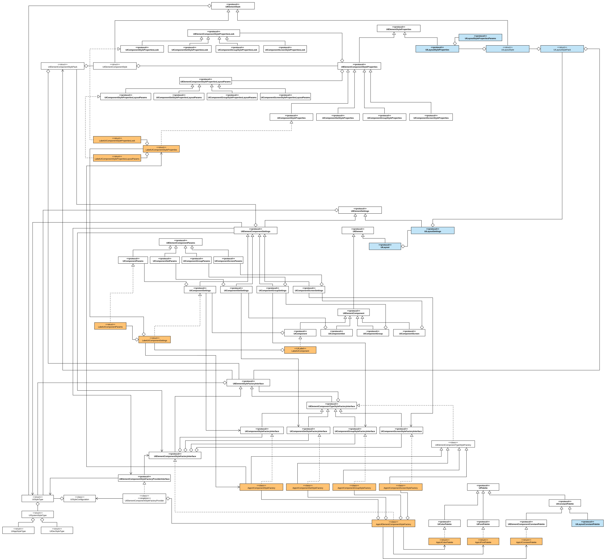

# GUIElements

## UML diagrams

### Library architecture

[Show diagram as PDF](./docs/UML/class-diagrams/library_architecture.pdf)

### All GUI-related components division

### All GUI-related components

### All GUI-related components styles

